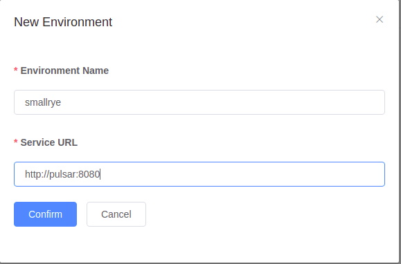

# Setting Up development environment

## Pre-requisites

* Docker
* Docker Compose

## Run the Apache Pulsar containers

This will get pulsar and pulsar admin containers running

    cd src/test/pulsar-cluster
    docker-compose up -d

Give some time to the containers to start. Then set up initial admin running:

    ./setadmin.sh

To access de admin ui access :

    http://localhost:9527

The default password (defined in the script ) is apachepulsar with password apachepulsar. If you want to change that,
edit the setadmin.sh file and change the values.

Create a new environment as the image below.

